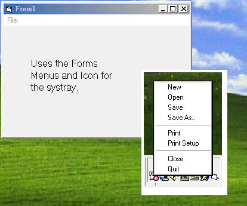



## A\+\+     Put Your Program in the System Tray Quick and Easy

### Description

Put your application in the systray with ease. Allows you to put your program in the systray for easier access for the user.
 
### More Info
 

             |
---                |---
**Submitted On**   |2001-11-30 22:21:56
**By**             |[s4t4n](https://github.com/Planet-Source-Code/PSCIndex/blob/master/ByAuthor/s4t4n.md)
**Level**          |Advanced
**User Rating**    |4.7 (216 globes from 46 users)
**Compatibility**  |VB 5\.0, VB 6\.0
**Category**       |[Complete Applications](https://github.com/Planet-Source-Code/PSCIndex/blob/master/ByCategory/complete-applications__1-27.md)
**World**          |[Visual Basic](https://github.com/Planet-Source-Code/PSCIndex/blob/master/ByWorld/visual-basic.md)
**Archive File**   |[A\+\+\_\_\_\_\_Pu387651212001\.zip](https://github.com/Planet-Source-Code/s4t4n-a-put-your-program-in-the-system-tray-quick-and-easy__1-29372/archive/master.zip)

### API Declarations

A must have for any coder.

